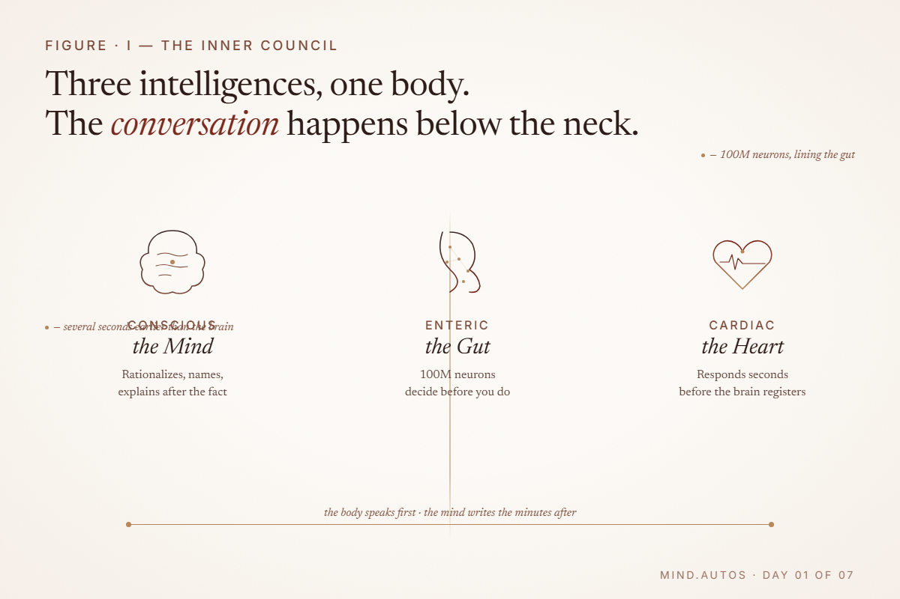
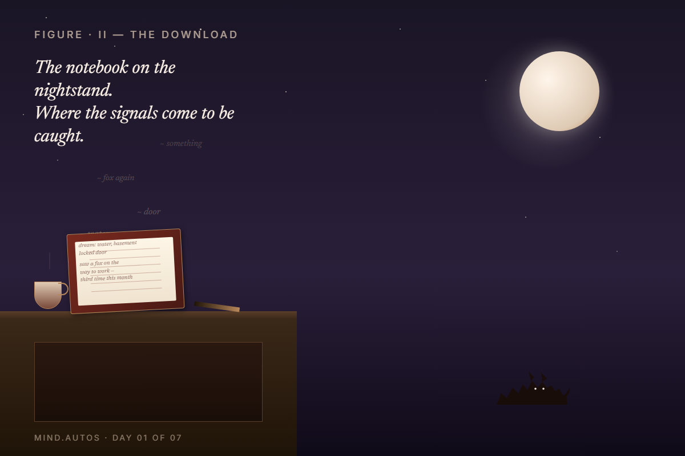
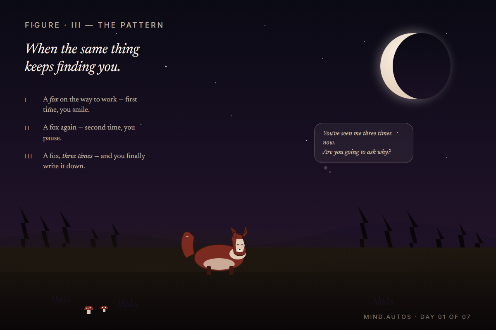
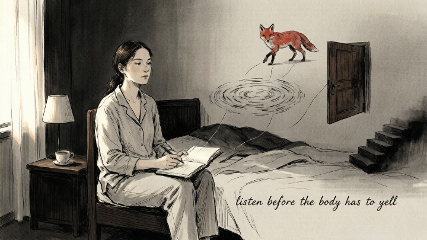

> Your intuition isn't a whisper — it's a language you learned before words, and forgot how to speak.

 

---

A friend of mine is thirty-four, a project manager, great at her job. She could not make a single decision without calling three people first.

Not because she was weak. Because every time she trusted her own read — on a person, a job offer, a relationship — something inside her said *no* so quietly she talked herself out of listening. Weeks later, the thing she'd sensed would go wrong, went wrong. She started wondering if she was losing her mind.

**Here's the thing — her mind was fine.** She was ignoring her intuition so thoroughly that her body had to start shouting.

Most of us were raised to override this stuff. Logic wins, feelings are flimsy, a spreadsheet beats a hunch.

> *The intuitive mind is a sacred gift and the rational mind is a faithful servant. We have created a society that honors the servant and has forgotten the gift.* — Albert Einstein

The funny thing is, modern science has been proving Einstein right for decades.

---

## 🔮 The Seven Signals — At a Glance

Before we dive in, here's what we're looking for:

- [ ] A physical sensation you can't explain
- [ ] Clarity that arrives when you stop searching
- [ ] An emotional reaction that contradicts the facts
- [ ] A symbol or pattern that keeps reappearing
- [ ] A dream that refuses to fade after you wake
- [ ] A decision that feels oddly light
- [ ] A nudge that returns no matter how many times you dismiss it

---

### 🧠 Why Does the Body Know Before the Brain Does?

Your **enteric nervous system** — more than a hundred million neurons lining your gut — runs like a second brain. It processes sensory information on its own and sends conclusions upward before your conscious mind forms a single thought.

> Carl Jung called intuition *"perception via the unconscious."* He wasn't describing anything mystical. He meant your brain cross-references every micro-expression, vocal tone, and body-language cue against a lifetime of stored interactions, reaches a verdict, and hands it to you as a *feeling*. You never see the spreadsheet. You just get the answer.

The HeartMath Institute recorded something even stranger: the heart responds to emotional stimuli several seconds *before* the brain registers the event.

> *The heart has its reasons which reason knows nothing of.* — Blaise Pascal

**The body knows first. The mind rationalizes later.**

---

### 🤔 Is It Anxiety, or Is It Intuition?

Here's the most practical distinction I've found:

- **Anxiety loops.** It circles the same worry, builds on itself, gets louder the more you feed it. It lives in the future — what *might* happen, what *could* go wrong.
- **Intuition arrives once and settles.** It doesn't argue. It doesn't need to convince you. It states its piece and goes quiet. It lives in the present — what *is*, right now.

That flutter in your stomach before a bad date? The heaviness walking into a room that felt fine a moment ago? **Those aren't metaphors. They're data.**

---

### 💓 Signal #1: Why Does My Body React Before My Mind Catches Up?

**The core answer:** Your body processes sensory information faster than your conscious awareness can track, and it signals you through physical sensations before you have words for what's happening.

Tight chest before a decision you haven't consciously processed. A sudden warmth when someone tells the truth. Unexplained exhaustion in a conversation that looks fine on the surface. If your body reacts before your mind forms an opinion, **take note.**

It's worth paying attention to *where* in your body signals tend to land — gut, chest, throat, shoulders. Over time, you'll notice a personal pattern. That's not random. That's your specific intuitive channel.

Of course, this isn't the same for everyone. Some people feel it in their stomach, others in their shoulders or jaw. Wherever it lands for you is valid.

---

### 🌙 Signal #2: Why Do Answers Arrive When I Stop Looking?

**The core answer:** Your unconscious mind continues processing problems in the background. When conscious focus relaxes — in the shower, while driving, just before sleep — solutions that were blocked by effort finally surface.

> Jung described the unconscious as a problem-solving engine that works while the ego is occupied. It chews on complexity and delivers results when awareness finally quiets down.

> *What is essential is invisible to the eye.* — Antoine de Saint-Exupéry

Try keeping a notebook by your bed. Most people let these "downloads" dissolve by morning without ever catching them. Even writing down a single word can anchor the insight long enough to work with it the next day.

In my experience, the shower is just as reliable as the bedroom. Something about water and solitude shuts off the noise.

---

### 🪞 Signal #3: Why Does a Stranger Feel Familiar — or a Friend Feel Wrong?

**The core answer:** Your brain runs pattern-matching on micro-expressions, vocal tone, and body language against every interaction you've ever stored, reaching a verdict before your conscious mind can articulate why.

Psychologists call this **thin-slice judgment** — snap impressions that often prove more accurate than careful analysis.

> *Trust yourself. You know more than you think you do.* — Dr. Benjamin Spock

Someone says all the right things, but something inside you pulls back. Or a stranger feels immediately familiar — not past lives, just your brain processing them faster than awareness can track. **Your brain already ran the pattern. It's showing you the result.**

Whether you act on it is a separate question. But pretending you didn't notice won't make it wrong.

---

### 🕯️ Signal #4: Why Does the Same Symbol Keep Appearing in My Life?

**The core answer:** Recurring symbols — numbers, animals, phrases — are either your brain's pattern-recognition system flagging what matters, or the psyche drawing your attention toward something unacknowledged. Either way, the practical response is the same: pay attention.

> Jung spent years studying synchronicity — meaningful coincidence that can't be explained by cause and effect. He argued these patterns surface when the psyche wants to redirect your attention toward something you've been avoiding.

Some people frame this as the universe sending a message. Others see it as the **reticular activating system** filtering for what's emotionally charged. Honestly, both explanations lead to the same move: if something keeps showing up, **it wants your attention.**

---
#### 🧪 Quick Self-Check

Before we continue, pause for a moment. Ask yourself:

**Have I noticed any of these in the past week?**

- A physical reaction I dismissed as "nothing"
- A random answer that popped into my head out of nowhere
- Someone whose energy felt off despite their words being fine
- A number, animal, or phrase I've seen three or more times

If you checked at least one box, **your intuition is already online.** You're just not in the habit of listening.

---

### 🌌 Signal #5: Why Does a Dream Follow Me Through the Day?

**The core answer:** Vivid, persistent dreams are the unconscious mind processing emotions and unresolved material in symbolic form. A dream that lingers is carrying something you haven't yet acknowledged in waking life.

REM sleep is essential for emotional processing and creative problem-solving — sleep science and Jungian analysis agree on this point, from completely different starting positions.

> *Who looks outside, dreams; who looks inside, awakes.* — Carl Jung

If a dream leaves a residue, **write down whatever you remember**, even just a fragment — a color, an object, an emotion. The meaning usually surfaces within a week on its own. You don't need a dream dictionary. You need a notebook and a little patience.

---

### 🪶 Signal #6: Why Does the Right Decision Feel Light?

**The core answer:** When a choice aligns with your values and unconscious knowledge, the brain doesn't resist it. Cognitive ease — a quiet sense of rightness without friction — is the absence of internal conflict, not the presence of excitement.

Psychologists call this **cognitive ease.** A decision that feels light isn't euphoric. It isn't exciting. It's just... smooth. No resistance. No internal argument.

> Here's the distinction that matters: excitement is loud. It wants you to know about it. Ease is quiet. It doesn't need to convince you of anything. Learning to tell them apart is one of the most grounded intuition skills you can build.

That said, it doesn't work every time. Some decisions are supposed to feel heavy — that's not a failed signal, that's the weight of what's at stake.

---

### 🌀 Signal #7: Why Won't This Thought Leave Me Alone?

**The core answer:** A recurring impulse — an idea, a direction, a person — that returns no matter how many times you dismiss it is a signal that hasn't been acknowledged. The unconscious repeats itself until it's heard.

> *The cave you fear to enter holds the treasure you seek.* — Joseph Campbell

Jung wrote that **what we resist persists,** and what we refuse to see in ourselves we meet as fate. This isn't obsession. It's a signal that hasn't been acknowledged.

And honestly? Most people don't fail to notice this signal. **They notice it and choose not to act.** That's the harder pattern to break — not the noticing, but the trusting.

---

## 🧭 Where This Leaves Us

So we've got seven signals, each with its own signature:

* Physical reactions that arrive before thoughts do
* Answers that surface when effort relaxes
* Emotional truths that contradict surface-level facts
* Symbols that return until they're acknowledged
* Dreams that carry unresolved material into waking life
* Decisions that feel light because there's nothing to resist
* Nudges that persist because the message hasn't been received

---

## 🔮 What Happens When You Recognize the Signal but Can't Read the Message?

Recognizing the signals is step one. **Interpreting them is where it gets harder** — because you're standing too close to your own patterns to see them clearly.

Sometimes a second pair of eyes is all it takes. Oranum screens every psychic through a **live demonstration reading** before they can accept paid sessions — so you're not talking to someone who just filled out a form. Their refund policy is straightforward: if the reading doesn't feel right, you can ask for your money back within twenty-four hours. For newcomers, a first session costs less than lunch. No subscription, no commitment.

**Try it once.** If nothing else, you'll learn something about how your own signals work — and that alone is worth the price of a sandwich.

---

Back to my friend, the project manager.

She started keeping a notebook on her nightstand. Not a journal — just scraps. *Dream: water, basement, locked door. Saw a fox on the way to work — third time this month.* Two weeks in, patterns she'd been too busy to notice surfaced on their own.

She didn't turn psychic. **She turned into someone who listens before her body has to yell.**

The relationship she was in when this started? She left it six months later — not because a tarot card told her to, but because she finally heard what her own body had been saying for years.

She's fine now. Better than fine. She trusts herself.

---

*Next time: what happens when you can't tell the difference between fear and intuition — that was her next question, and it's the one most people get stuck on.*
