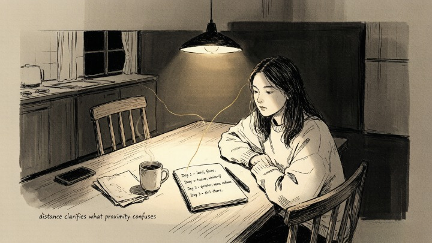
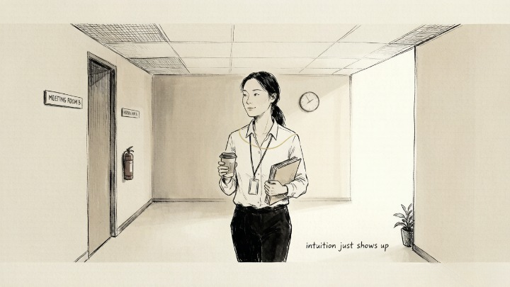

> Fear feels like a wall. Intuition feels like a door you're scared to open.

---

A colleague of mine almost didn't take the job. The offer was on the table — better title, better money, a team she actually wanted to work with. Every logical signal said yes. But something in her chest tightened every time she imagined herself sitting at that new desk. She called it intuition.

Six months later, she told me she'd been wrong. It wasn't intuition. It was fear of being inadequate in a bigger role. She'd dressed anxiety up as inner wisdom and let it make the decision for her.

She's not alone in that. I'd bet most people who say "my gut told me no" are actually describing fear — and most people who ignore their intuition are actually describing a voice so quiet it gets buried under the noise of their own second-guessing.

**The question isn't whether you can trust yourself. The question is whether you can tell which voice is talking.**

---

## 🧭 Fear vs. Intuition — The Short Version

Before we go deep, here's the cheat sheet:

- [ ] Fear is loud, repetitive, and feeds on "what if"
- [ ] Intuition is quiet, singular, and arrives with "this is"
- [ ] Fear lives in the future — catastrophes that haven't happened
- [ ] Intuition lives in the present — truth that's already here
- [ ] Fear tightens. Intuition stills.

---

### 🧠 What Neuroscience Says About the Two Voices

Your brain has two major threat-detection systems, and they sound almost identical.

The **amygdala** is your fear center. It fires fast — faster than your conscious mind can track — and its job is to keep you alive. It doesn't care whether the threat is a tiger or a tough conversation with your boss. It just sounds the alarm.

The **insula** and **anterior cingulate cortex** process interoception — your body's internal signals. When you get a "gut feeling," these regions are integrating subtle physical cues, pattern memories, and emotional data into a single, quiet verdict.

> The amygdala screams. The insula whispers. Both feel like "something is wrong." Learning to tell them apart isn't mysticism — it's interoceptive literacy. You're learning to read your own nervous system.

> *The first rule is to keep an untroubled spirit. The second is to look things in the face and know them for what they are.* — Marcus Aurelius

---

### 🔥 Signal #1: Fear Is Loud. Intuition Is Quiet.

**The core answer:** Fear demands your attention immediately with urgency and volume. Intuition states its piece once and doesn't argue.

Here's a practical test. Next time you feel a strong internal "no," ask yourself: *is this voice getting louder the more I think about it?* If yes, it's probably fear. Anxiety escalates with attention. Intuition doesn't. It stays the same volume, the same tone, whether you listen or not.

I've noticed that fear feels like someone shouting in your ear. Intuition feels like someone tapping your shoulder once and then waiting. **If the message needs to repeat itself to get louder, it's fear. If it holds steady, pay attention.**

Of course, this isn't foolproof — everyone's nervous system works differently.

---

### ⏳ Signal #2: Fear Lives in the Future. Intuition Lives in the Present.

**The core answer:** Fear is always about what *might* happen. Intuition is about what *is* happening, right now.

Fear says: "What if this goes wrong? What if they reject you? What if you fail?" Every sentence starts with "what if."

Intuition says: "This isn't right." Or "This is." No timeline. No projection. Just the present moment, assessed cleanly.

> *The oldest and strongest emotion of mankind is fear, and the oldest and strongest kind of fear is fear of the unknown.* — H.P. Lovecraft

My colleague's fear about that job was entirely future-based — a role she hadn't tried yet, failures that hadn't happened yet. Real intuition would have sounded completely different: "This isn't the right fit" (present tense) or "Something feels off about this team" (present observation). The future-orientation was the giveaway.

---

### 🪞 Signal #3: Fear Tightens. Intuition Stills.

**The core answer:** Fear creates physical tension — clenched jaw, tight chest, shallow breathing. Intuition creates stillness — a calm knowing, even when the message is uncomfortable.

**The body doesn't lie, but it speaks two different languages.** The next time you're trying to distinguish fear from intuition, scan your body:

* Shoulders up by your ears?
* Jaw locked?
* Stomach churning with urgency?
* Breathing shallow and fast?

That's the fear response. Your sympathetic nervous system just got activated.

Now imagine receiving a hard truth from someone you trust — something you don't want to hear but know is accurate. The weight in your chest might be there, but there's no *rush.* No urgency. Just recognition. **That's what intuition feels like in the body — truth without panic.**

> *Between stimulus and response there is a space. In that space is our power to choose our response. In our response lies our growth and our freedom.* — Viktor Frankl

---

#### 🧪 Quick Self-Check

Take a decision you're wrestling with right now. Ask yourself:

**If I removed all the "what ifs" — every projection into the future — what would be left?**

* Am I afraid of an outcome that hasn't happened yet? → Fear
* Does my body feel tight, rushed, or flooded with adrenaline? → Fear
* Is the message quiet, simple, and here right now? → Intuition
* Would this feeling still be true if nobody else ever knew about it? → Intuition

---

### 🌀 Signal #4: Fear Is Reactive. Intuition Is Neutral.

**The core answer:** Fear carries emotional charge — guilt, shame, panic, dread. Intuition is emotionally neutral. It delivers information without drama.

This is the hardest one to detect in real time, because fear and intuition both arrive as *feelings.* The distinction is in the texture of the feeling.

A friend of mine was deciding whether to leave a twelve-year relationship. When she thought about staying, she felt guilt and shame — *fear about being alone,* not intuition about whether the relationship was right. When she got quiet enough to separate the signals, what remained wasn't panic. It was a quiet, neutral knowing: *this chapter is over.* Not sad. Not angry. Just: over.

**Intuition doesn't try to convince you of anything.** That's how you know it's real. Fear sells. Intuition just shows up.

---

## 🧭 Putting It Together

So you've got a decision, and a feeling, and you're staring at both of them trying to figure out which one to trust. Here's what works for me:

* Step back from the decision for twenty-four hours. Not forever — one day.
* Write down the feeling: what it sounds like, where it sits in your body, whether it's loud or quiet.
* Come back after a day and read what you wrote. **Distance clarifies what proximity confuses.**

Nine times out of ten, fear looks smaller from a day away. Intuition looks exactly the same.

---

## 🔮 When You've Done the Work and Still Feel Stuck

Sometimes you've run every checklist, scanned your body, journaled for a week — and the signal still isn't clear. That's not failure. It just means you're too close to read your own patterns.

A skilled reader can help separate the noise from the signal in about twenty minutes — because they're not carrying your history. Oranum screens every psychic through a **live demonstration reading** before they can accept paid clients. Their refund policy is straightforward: if the reading doesn't feel right, you can ask for your money back within twenty-four hours. First session for newcomers costs less than a sandwich. No subscription, no strings.

**Try it once.** Worst case: you confirm what you already knew. Best case: you hear something that cuts through the noise you've been living in.

---

Back to my colleague — the one who almost didn't take the job.

She sat with the decision for three days, journaling her way through the fear. Eventually she took the offer. The first six weeks were hard — new people, new systems, the normal chaos of being the least experienced person in the room.

But about two months in, her chest stopped tightening. Her real intuition — the quiet one — had been saying yes all along. She just couldn't hear it over the volume of her own self-doubt.

She learned the difference. It changed everything.

---

*Next time: five physical signs your gut feeling is right — because your body keeps score in ways your mind hasn't caught up with yet.*
