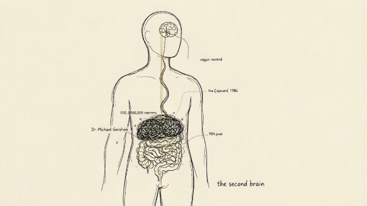
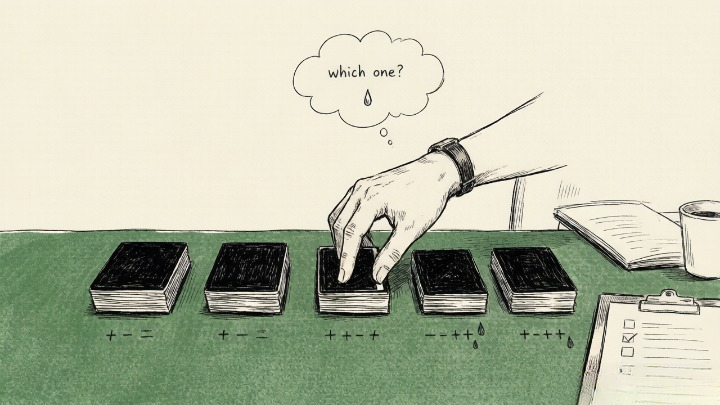

> Neuroscience just proved what your gut has been telling you all along.

---

For most of human history, intuition wasn't a controversial concept. It was survival. The hunter who sensed danger in the silence. The mother who woke in the night before her child cried. The trader who knew — without evidence — that a deal was wrong.

Then the Enlightenment arrived. Reason became king. Intuition got demoted to "women's superstition," "just a feeling," "not real data." The split was clean: logic was truth, and everything else was noise.

Turns out the Enlightenment was wrong. Not because logic isn't valuable — but because the *sources* of reliable knowledge are wider than we were taught. And modern science, with all its machines and measurements, has spent the last forty years proving it.

---

## 🧬 The Second Brain in Your Gut

In 1996, Dr. Michael Gershon published *The Second Brain,* a book that changed how neuroscience understands consciousness. His research focused on the **enteric nervous system** — a sheath of more than 100 million neurons lining the gastrointestinal tract from esophagus to colon.

That's more neurons than your spinal cord.

> The enteric nervous system operates independently of the central nervous system. It can process sensory information, learn from experience, and generate emotional states without any input from the brain. When you feel something in your gut, that feeling is being generated by a second brain — not imagined, not metaphorical, but electrically and chemically real.

The vagus nerve — a thick cable of neural tissue running from gut to brainstem — carries about 90% of its information *upward.* Your gut talks to your brain more than your brain talks to your gut. Your conscious mind isn't in charge of this conversation. It's listening in.

> *The only real valuable thing is intuition.* — Albert Einstein

---

### ❤️ What the HeartMath Institute Found

In the 1990s, researchers at the HeartMath Institute in California began studying something that shouldn't have been possible. They wired subjects to EEG and ECG monitors, then showed them a series of images — some neutral, some disturbing — in random order.

The results were impossible under standard neuroscience models. Participants' hearts showed measurable physiological responses to disturbing images **several seconds before the images appeared on screen.** Their bodies were reacting to future stimuli.

> The heart contains its own intrinsic nervous system — around 40,000 neurons that process information independently. The electromagnetic field generated by the heart is roughly sixty times stronger than the brain's, and it extends several feet from the body. HeartMath's research suggests the heart isn't just a pump — it's a sensory organ that processes emotional and intuitive information faster than the brain can track.

The implications are significant: **your body knows things before your conscious mind has access to them.** The research doesn't explain *how* — the mechanism is still being studied. But it confirms that the phenomenon is real, measurable, and repeatable.

---

### 🧠 Thin-Slice Judgment: Why Snap Decisions Beat Analysis

In 1992, psychologist Nalini Ambady published research that shook the field of social cognition. She showed participants short, silent video clips of professors teaching — just ten seconds each. She asked them to rate the professors on effectiveness. Then she compared those ratings to end-of-semester student evaluations.

The correlation was striking. Ten-second snap judgments nearly matched three months of student experience.

Ambady called this **thin-slice judgment** — the ability to extract meaningful information from extremely brief exposures. Subsequent research expanded the finding: thin-slice judgments often outperform careful, deliberate analysis, particularly in complex social situations.

> Your brain's pattern-matching machinery runs thousands of comparisons in the time it takes you to form a single conscious thought. The result arrives as a "feeling" because there's no faster way to deliver it. Intuition isn't the absence of analysis — it's analysis at a speed and depth that conscious thought can't match.

> *Trust yourself. You know more than you think you do.* — Dr. Benjamin Spock

---

### 🔬 The Iowa Gambling Task: When Knowing Comes Before Understanding

One of the most replicated findings in intuition research comes from Antonio Damasio's lab at the University of Iowa. Participants played a card game — the "Iowa Gambling Task" — choosing cards from four decks. Two decks were rigged to produce long-term losses. Two were advantageous.

**The finding:** participants' palms started sweating (a stress response measured by skin conductance) when reaching for the bad decks *long before they could consciously explain which decks were bad.* Their bodies had figured out the pattern. Their conscious minds hadn't caught up yet.

Some participants never articulated the strategy. But their bodies knew. And their bodies steered them toward better choices anyway.

**The implication is clear: you don't need to understand why something feels wrong for the feeling to be valid.** The body's pattern-recognition operates below the level of conscious explanation. Waiting until you can articulate the reason often means waiting too long.

---

#### 🧪 What This Means For You

If the science is consistent — and it is — then a few conclusions follow:

* Your gut feelings are generated by a real, measurable neural network
* Your heart processes emotional information before your brain does
* Your snap judgments are often more accurate than your careful analysis
* Your body can detect patterns you can't consciously explain

**Intuition isn't magic. It's biology we're just beginning to understand.**

---

## 🔮 When You Want to Test This For Yourself

Reading about intuition is one thing. Experiencing it in a context where someone else can reflect your patterns back to you is another entirely.

A skilled psychic or tarot reader doesn't tell you your future. They help you see your present more clearly — the patterns, the blind spots, the signals your body has been sending that you've learned to ignore. Oranum screens every reader through a **live demonstration reading** before they can accept clients. Their refund policy is simple: if it doesn't feel right, you can ask for your money back within twenty-four hours. First-time sessions cost less than lunch. No subscription. Just curiosity.

**Try it once.** Even if you're skeptical, pay attention to your body during the session. Notice when something lands. That's your intuition, recognizing a truth it already knew.

---

*Next time: three simple morning rituals to strengthen your intuition — starting with one you can do before you even get out of bed.*
